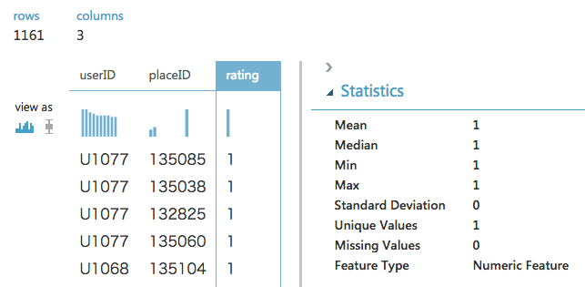
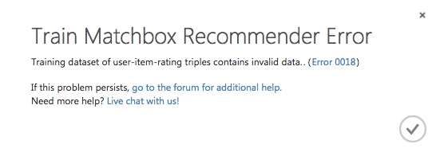
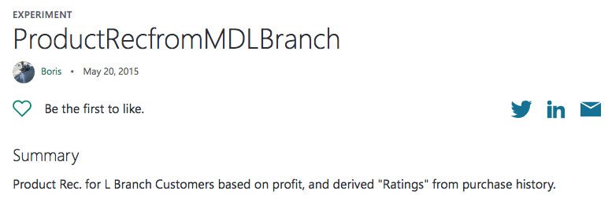
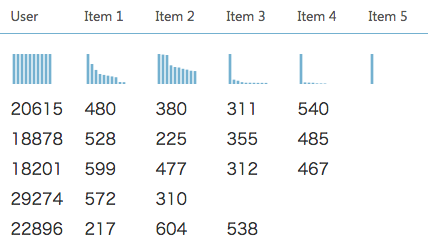

# Azure Machine Learningで レコメンド
#### 第11回 Cogbot勉強会！(2018/01/23)
#### nikkie

---

### nikkie （にっきー）

- ソフトウェアエンジニア2年目
- 2018/01〜 業務でAzure Machine Learning利用中
- 趣味: アニメ、Python
- [Pythonでアニメ画像のモザイクアート作ってみた](https://speakerdeck.com/ftnext/pillow-mosaic-art-nyumon)

+++

### nikkie (@ftnext)

- [Twitter @ftnext](https://twitter.com/ftnext)
- [Azure Machine Learningの初歩の初歩](http://nikkie-ftnext.hatenablog.com/entry/2017/12/31/230251)
- [Azure Machine Learningの初歩](https://qiita.com/ftnext/items/5852d142050b960b2777)
- [Azure Machine Learningで「最適なアルゴリズムを選択する」には](https://qiita.com/ftnext/items/94d220a5e6c50b43e478)

+++

### 質問・指摘お待ちしています

- 以下、お品書きです。
- Azure Machine Learningの流れ
- レコメンダーを作る
- 購買履歴から評価値を得る
- サンプルを元にした実装例
- まとめ

---

### Azure Machine Learningでレコメンド

- このLTではレコメンドシステムをレコメンダーと呼びます
- Azure Machine Learning Studioでレコメンダーを作る方法を話します |
- Azure Machine Learningを触ったことがある方向けです |

+++

### Azure Machine Learningの流れ

[TechSummit 2017 Japan : Hands on Learning 資料](https://github.com/ayako/TS17-AzureMLHoL/blob/master/TS17_AzureMLHoL_UWP.pdf) 目次

+++

### Azure Machine Learningの流れ

[TechSummit 2017 Japan : Hands on Learning 資料](https://github.com/ayako/TS17-AzureMLHoL/blob/master/TS17_AzureMLHoL_UWP.pdf) 目次

+++

### Azure Machine Learningの流れ

[TechSummit 2017 Japan : Hands on Learning 資料](https://github.com/ayako/TS17-AzureMLHoL/blob/master/TS17_AzureMLHoL_UWP.pdf) 目次

+++

### Azure Machine Learningの流れ

[TechSummit 2017 Japan : Hands on Learning 資料](https://github.com/ayako/TS17-AzureMLHoL/blob/master/TS17_AzureMLHoL_UWP.pdf) 目次

+++

### Azure Machine Learningの流れ

[TechSummit 2017 Japan : Hands on Learning 資料](https://github.com/ayako/TS17-AzureMLHoL/blob/master/TS17_AzureMLHoL_UWP.pdf) 目次

+++

### Azure Machine Learningの流れ

[TechSummit 2017 Japan : Hands on Learning 資料](https://github.com/ayako/TS17-AzureMLHoL/blob/master/TS17_AzureMLHoL_UWP.pdf) 目次

+++

### Azure Machine Learning Studioでは

https://raw.githubusercontent.com/ayako/TS17-AzureMLHoL/master/media/4-07.PNG をもとに作成

---

### レコメンダーを作る

- レコメンダーでできること
- レコメンダー用モジュール
- レコメンダーの学習に使うデータ
- レコメンダーの例

+++

### レコメンダーでできること

- あるユーザに対してアイテムをレコメンドする
- あるユーザのあるアイテムへの評価値を予測する
- あるユーザに関係のあるユーザを見つける
- あるアイテムに関係のあるアイテムを見つける

+++

### レコメンダー用モジュール

- データの前処理: Split Data
  - PropertiesのSplitting modeに**Recommender Split**を指定する |
- 学習: Train Matchbox Recommender |
- 予測: Score Matchbox Recommender |
- 評価: Evaluate Matchbox Recommender |

+++

### レコメンダーの学習に使うデータ

- 評価データ(学習に必須)
  - ユーザID - アイテムID - 評価値 の形式 |
  - 例：ユーザU001がアイテムA01を星2と評価した |
- ユーザの属性データ
  - U001の性別、年齢など |
- アイテムの属性データ
  - A01のカテゴリ情報など |

+++

### レコメンダーの例

- レストランのレコメンド |
  - [Microsoft Azure Machine Learning レコメンドを試してみた(データ編)](https://azure-recipe.kc-cloud.jp/2016/03/ml_recommend_data/) |
  - [Microsoft Azure Machine Learning レコメンドを試してみた(モデル作成編)](https://azure-recipe.kc-cloud.jp/2016/04/ml_recommend_model/) |
- 映画のレコメンド |
  - [Azure Machine Learning による推薦システムを構築する手順書](https://www.slideshare.net/masayuki1986/azure-machine-learning-49034325) |

---

### 購買履歴から評価値を得る

- 購買履歴: 「誰がどの商品を買った」というデータ
- 学習に必要なのは「誰がどの商品を星いくつと評価した」というデータ |

+++

### 購買履歴から評価値を得る

- 評価値を固定してみる:「購入者は買った商品を星1と評価した」
- レストランのサンプルのデータを加工し、実験

+++

### 購買履歴から評価値を得る

- レストランのサンプルのデータを加工し、実験 → 失敗
- 評価値がすべて同じためにエラーが出るらしい

+++

### 購買履歴から評価値を得る

Azure AI Galleryに購買履歴を使った事例がないか検索

+++

### 購買履歴から評価値を得る

Azure AI Galleryに購買履歴を使った事例がないか検索
https://gallery.cortanaintelligence.com/Experiment/ProductRecfromMDLBranch-3

+++

### 購買履歴から評価値を得る

- 購入回数を評価値とみなして評価データを用意 |
  - あるユーザが同じ商品を3回買っていたら、その商品への評価は3となる |
  - 学習に使う評価値はほとんどが1だが、1より大きい値もわずかに含まれる |
- ユーザの属性データ、アイテムの属性データは購買履歴から抽出できる |

---

### サンプルを元にした実装例

+++?image=image/recommend_sample-1.png&size=auto 90%

+++?image=image/recommend_sample-2.png&size=auto 90%

+++?image=image/recommend_sample-3.png&size=auto 90%

+++?image=image/recommend_sample-4.png&size=auto 90%

+++?image=image/recommend_sample-5.png&size=auto 90%

+++?image=image/recommend_sample-6.png&size=auto 90%

+++?image=image/recommend_sample-7.png&size=auto 90%

+++

### サンプルを元にした実装例 Scoreモジュールの出力

---

### まとめ

- Azure Machine Learningでレコメンダーを作るには、専用モジュールを使う |
- レコメンダーの学習には ユーザID - アイテムID - 評価値 の形式のデータが必須 |
- 評価値として購入回数を用いることで、購買履歴からレコメンダーを作成できる |

+++

### ご清聴ありがとうございました

質問・指摘がありましたら、@ftnextまでお願いします

LTスライド: https://gitpitch.com/ftnext/CogBot11-LT-201801
